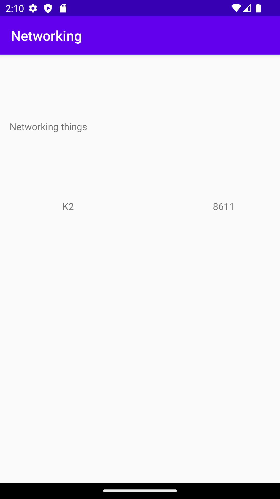

# Rapport

**Skriv din rapport här!**

Först forkade jag projektet networking från github. Denna uppgift focuserade på att
skapa en recyclerview med information om olika berg. 

Jag lade därför till en recyclerview i min layout i activityMain. Sedan lade jag till de variabler jag 
behövde i min activity. Efter detta skapade jag en recylcerview adapter och en viewholder.

      RecyclerView = findViewById(R.id.myRecycler_view);
        berg = new ArrayList<Mountain>();
        adapter = new BergAdapter(berg);
        RecyclerView.setAdapter(adapter);
        RecyclerView.setLayoutManager(new LinearLayoutManager(this));

Koden ovan visar hur jag deklarerat variablerna. 
Efter detta skulle man använda getJson för att ladda ner json datan. Detta gjordes i onPostExecute
och eftersom vi använde en URL och inte en fil så behövde jsonfile ändras till jsontask.

        new JsonTask(this).execute(JSON_URL);
    }

    @Override
    public void onPostExecute(String json) {
        Log.d("tomten", "onPostExecute: " +json);

        Gson gson = new Gson();
        Type type = new TypeToken<ArrayList<Mountain>>() {}.getType();
        ArrayList<Mountain> data = gson.fromJson(json, type);
        berg.addAll(data);
        adapter.notifyDataSetChanged();

Koden ovan visar hur onPostExecute koden ser ut. 
Sist så skulle datan från json urlen visas i vår recyclerview. Man behövde då
välja vad för data från filen vi ville använda. I detta fall var det namn och storlek. 
På bilden syns hur recyclerviewn ser ut på appen.
För att ha något att sätta datan i behövde man textView som kan representera datan inuti.
Nedan är koden för viewholdern.

     public ViewHolder(@NonNull View itemView) {
        super(itemView);
        name = itemView.findViewById(R.id.name);
        size = itemView.findViewById(R.id.size);
    }

